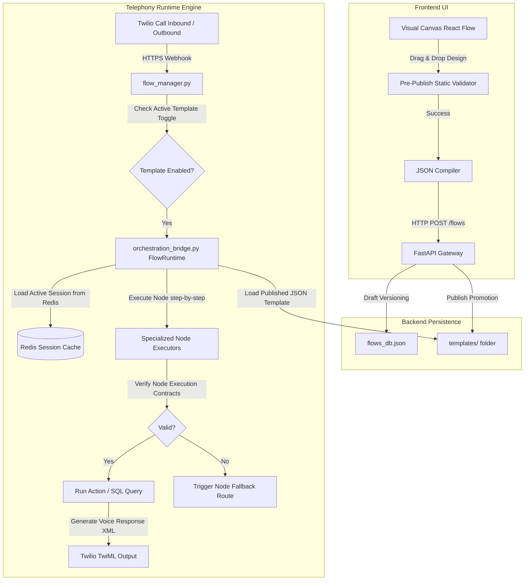

# Configurable Visual Flow Builder: System Architecture & Execution Blueprint

This document presents the refined architectural design and implementation plan for the UI-driven **Configurable Flow Builder** layer. 

The goal is to allow business users to visually design conversation flows (nodes and transitions) via a frontend interface, which are then compiled into standard JSON configurations, saved to the backend database, and dynamically executed by the `FlowRuntime` interpreter.

---

## 1. Separation of Concerns: Flow Runtime vs. AI Reasoning

To ensure maintainability, low-latency execution, and clear debugging paths, the architecture explicitly separates **deterministic execution** from **cognitive understanding**:

```
┌────────────────────────────────────────────────────────┐
│                   FLOW RUNTIME LAYER                   │
│   (State Transitions, Node Execution, Safety Gates)   │
└───────────────────────────┬────────────────────────────┘
                            │ Queries / Invokes
                            ▼
┌────────────────────────────────────────────────────────┐
│                   COGNITIVE AI LAYER                   │
│  (Intent Classifiers, Typo Parsers, FAQ KB Engines)    │
└───────────────────────────┬────────────────────────────┘
                            │ Emits Telemetry
                            ▼
┌────────────────────────────────────────────────────────┐
│               OBSERVABILITY & GOVERNANCE               │
│      (Event Logging, Replays, Schema Guards)           │
└────────────────────────────────────────────────────────┘
```

### A. Flow Runtime Layer (Deterministic Engine)
* **Responsibilities**: Executes steps, parses JSON flow nodes, evaluates explicit variables, checks condition handles (`true`/`false`), tracks iteration depths, and manages retry counters.
* **Property**: Strictly deterministic, predictable, and ultra-fast. No remote API calls are made for transition routing itself.

### B. Cognitive AI Layer (Reasoning & NLP)
* **Responsibilities**: Translates speech inputs (Hinglish/Devanagari $\rightarrow$ English), categorizes intent tags (`INTERESTED`, `BUSY`, `REJECTED`), normalizes spelling typos, and extracts entity fields (dates, mileage, locations).
* **Property**: Probabilistic, adaptive, and decoupled from transition execution. It is queried by the runtime during evaluation steps but does not control call routing directly.

---

## 2. System Architecture: UI → JSON → Runtime



---

## 3. Node Type Schemas & Execution Contracts

To enforce system boundaries, every node type defines strict execution contracts detailing required inputs, output keys, fallback routes, and timeouts.

### A. Message Node (`messageNode`)
* **Contract**:
  * *Inputs*: Context variables used in placeholders.
  * *Outputs*: None (Spoken text output).
  * *Timeout*: None (Voice say).
```json
{
  "id": "intro_greeting",
  "type": "messageNode",
  "data": {
    "label": "Hello {{salutation}} {{name}}, calling regarding your {{car}}.",
    "inputs": ["name", "salutation", "car"],
    "outputs": [],
    "failure_transition": "receptionist_fallback"
  }
}
```

### B. API Node (`apiNode`)
* **Contract**:
  * *Inputs*: URL parameters or request payload variables.
  * *Outputs*: Context variables populated from HTTP response payload.
  * *Limits*: Timeout threshold (default 8s), maximum retry loops (default 2).
```json
{
  "id": "crm_lookup",
  "type": "apiNode",
  "data": {
    "label": "http://mock/crm/{{from}}",
    "method": "GET",
    "inputs": ["from"],
    "outputs": ["name", "car", "provider"],
    "timeout_seconds": 8,
    "max_retries": 2,
    "failure_transition": "local_db_fallback"
  }
}
```

### C. Condition Node (`conditionNode`)
* **Contract**:
  * *Inputs*: Local variables checked by expression.
  * *Outputs*: Transition outcome flag (`true` or `false`).
```json
{
  "id": "check_service_due",
  "type": "conditionNode",
  "data": {
    "label": "is_due == true",
    "inputs": ["is_due"],
    "outputs": ["outcome"],
    "failure_transition": "receptionist_fallback"
  }
}
```

### D. Knowledge Base Node (`knowledgeBaseNode`)
* **Contract**:
  * *Inputs*: Speech input string.
  * *Outputs*: Intent/FAQ answer matching.
  * *Limits*: Confidence threshold (default 0.75).
```json
{
  "id": "faq_router",
  "type": "knowledgeBaseNode",
  "data": {
    "label": "Master FAQ Node",
    "capability": "query",
    "inputs": ["user_input"],
    "outputs": ["text", "intent"],
    "confidence_threshold": 0.75,
    "failure_transition": "fallback_nudge"
  }
}
```

### E. Action Node (`actionNode`)
* **Contract**:
  * *Inputs*: Direct SQL/service tasks params.
  * *Outputs*: Result code.
```json
{
  "id": "dnd_blocklist",
  "type": "actionNode",
  "data": {
    "action_type": "mark_dnd",
    "label": "Permanent DND Blocklist and Opt-Out"
  }
}
```

---

## 4. Runtime Safety & Infinite Loop Prevention

To prevent dynamically designed visual flows from crashing the telephony loop, the backend implements automated runtime safety gates:

1. **Cycle Limit Counter**: The runtime tracks execution hops within a single voice turn. If more than 15 transitions occur without requesting customer speech input (e.g. infinite loops of API $\rightarrow$ Condition $\rightarrow$ Context Logic nodes), the turn is immediately terminated and routed to a supervisor transfer node.
2. **Invalid Edge Block**: If the interpreter hits a node with missing or broken outbound edges, it redirects to the flow's root `fallback_handler`.
3. **Execution Timeout Ceilings**: Async API operations are wrapped inside uvicorn `asyncio.wait_for` loops with rigid maximum limits to avoid hanging connections.
4. **Session Isolation**: Each call leg uses thread-safe isolated sessions protected by memory-safe lock boundaries.

---

## 5. Reusable Subflow Architecture

To keep flow charts clean, modular, and easy to maintain, complex operational modules are encapsulated as reusable **Subflows**.

```
┌────────────────────────────────────────────────────────┐
│                    PARENT FLOW                         │
│                    (Pre-Sales)                         │
└───────────────────────────┬────────────────────────────┘
                            │ Jumps to Subflow Node
                            ▼
┌────────────────────────────────────────────────────────┐
│                    SUBFLOW NODE                        │
│            (e.g., Identity Verification)               │
└───────────────────────────┬────────────────────────────┘
                            │ Returns to Parent
                            ▼
┌────────────────────────────────────────────────────────┐
│                    PARENT FLOW RESUMES                 │
│                 (Check Upgrade Offers)                 │
└────────────────────────────────────────────────────────┘
```

* **Concept**: A specific visual node (type `subflowNode`) points to a standalone master template (e.g. `identity_verification.json`).
* **Modular Segments**: Standard subflow blocks are pre-compiled for:
  1. *Identity Verification* (Dual-factor reg number + phone lookup).
  2. *DND Handling* (DND checks, database opt-outs).
  3. *Expert Hand-off / Transfer* (Round-robin presence checks and routing).
  4. *Valet Slot Coordination* (Slot availability negotiations).
* **Return Transitions**: Once the subflow hits an `endNode`, the runtime returns the resulting flags (e.g. `identity_verified = true`) back to the parent canvas.

---

## 6. High-Availability State Persistence (Redis Integration)

To support horizontal scaling, failover recoveries, and distributed background workers across multiple campaigns, session storage is upgraded from local in-memory dictionaries to **Redis Persistence**:

1. **JSON Serialization**: Session records are serialized to JSON strings and cached in Redis with a TTL of 900 seconds.
2. **Distributed Locks**: Redis `SETNX` handles distributed concurrency locks, preventing concurrent webhooks (e.g. status callback and user message arriving simultaneously) from corrupting the call state.
3. **Failover Recovery**: If a backend FastAPI worker crashes, any replacement server can instantly fetch the state from Redis using the `CallSid` key and continue the call seamlessly.

---

## 7. Pre-Publish Static Graph Validation

To ensure no broken or cyclic configurations are promoted to production, the `/flows/{flow_id}/publish` API runs an automated compile-time validation check. If any of the following checks fail, promotion is blocked:

| Validation Rule | Impact | Description |
| :--- | :--- | :--- |
| **Start/End Node Check** | Critical | Verifies that exactly one `startNode` exists and at least one `endNode` is reachable. |
| **Cycle Detection** | Critical | Runs Tarjan's strongly connected components algorithm to find cyclic deadlocks. |
| **Orphan Node Check** | Warning | Finds and flags any node that has no incoming edges. |
| **Disconnected Edges** | Critical | Confirms every edge connects a valid `source` to a valid `target`. |
| **Fallback Path Check** | Critical | Verifies every `apiNode` and `knowledgeBaseNode` defines a valid `failure_transition` route. |

---

## 8. Operational Governance & Observability

To run a production-grade orchestration runtime, the system introduces structured telemetry, debug tools, and schema integrity guards:

### A. Structured Runtime Event Telemetry
Every node execution fires a telemetry payload, recording node metrics and latencies:
```json
{
  "timestamp": "2026-05-27T18:20:00Z",
  "session_id": "chat_a2c3d4",
  "node_id": "crm_lookup",
  "node_type": "apiNode",
  "event": "NODE_EXECUTED",
  "latency_ms": 142,
  "result": "SUCCESS",
  "context_updates": ["name", "car"]
}
```

### B. High-Fidelity Session Replay Audits
Every call transition is saved into the SQLite/PostgreSQL `orchestration_audit` table. This log forms a sequential timeline that enables **Visual Session Replays**:
```sql
SELECT timestamp, previous_node, current_node, trigger_reason, raw_input 
FROM orchestration_audit 
WHERE call_sid = 'chat_a2c3d4' 
ORDER BY timestamp ASC;
```
The dashboard interprets this audit log to draw a step-by-step canvas walkthrough, highlighting exactly which path the customer took (and where they interrupted).

### C. Schema Version Guardrails
To prevent code updates from breaking older published flows, the loader enforces strict dual-version checking:
```json
{
  "flow_id": "pre_sales_template",
  "version": 42,
  "schema_version": "1.4",
  "runtime_compatibility": ">=2.1"
}
```
If the server gets upgraded to runtime version `3.0` (which drops support for legacy configurations), the schema guard blocks execution and requests a visual compiler recompilation before calling the webhook.

### D. Extensible Plug-and-Play Node Registry
Rather than hardcoding routing cases, a registry dynamically maps string IDs to class executors. This allows developer teams to write third-party plugins safely:
```python
NODE_REGISTRY = {
    "startNode": PassThroughExecutor,
    "messageNode": MessageNodeExecutor,
    "apiNode": ApiNodeExecutor,
    "conditionNode": ConditionNodeExecutor,
    "knowledgeBaseNode": KnowledgeBaseNodeExecutor,
    "subflowNode": SubflowNodeExecutor
}
```

### E. Human Approval Gates
To manage enterprise risk, flows published by business designers do not go live instantly. Instead, they pass through a structured promotion lifecycle:
```
Draft Saved (flows_db.json)
       ↓
  Staging Test (simulate_flow API)
       ↓
   QA Review (Promote button clicked)
       ↓
Staging Approval (Staging Template created)
       ↓
Production Publish (Promoted to Master Template)
```

---

## 9. Canonical Flow Schema Specification

To prevent schema drift over time as different business users publish custom templates, the system defines a **strict, authoritative JSON Schema**. Every uploaded file is validated against this specification at the API boundary using a JSON-Schema validator (e.g. `jsonschema` in Python).

### A. Authoritative Flow JSON Schema
```json
{
  "$schema": "http://json-schema.org/draft-07/schema#",
  "title": "AlconFlowSpecification",
  "type": "OBJECT",
  "required": ["flow_id", "version", "schema_version", "status", "nodes", "edges"],
  "properties": {
    "flow_id": { "type": "STRING", "pattern": "^[a-z0-9_]+$" },
    "version": { "type": "INTEGER", "minimum": 1 },
    "schema_version": { "type": "STRING", "enum": ["1.0", "1.1", "1.2", "1.3", "1.4"] },
    "status": { "type": "STRING", "enum": ["draft", "staging", "master"] },
    "name": { "type": "STRING", "maxLength": 100 },
    "description": { "type": "STRING", "maxLength": 500 },
    "nodes": {
      "type": "ARRAY",
      "items": { "$ref": "#/definitions/Node" }
    },
    "edges": {
      "type": "ARRAY",
      "items": { "$ref": "#/definitions/Edge" }
    }
  },
  "definitions": {
    "Node": {
      "type": "OBJECT",
      "required": ["id", "type", "data"],
      "properties": {
        "id": { "type": "STRING", "pattern": "^[a-zA-Z0-9_-]+$" },
        "type": { 
          "type": "STRING", 
          "enum": ["startNode", "messageNode", "apiNode", "conditionNode", "knowledgeBaseNode", "actionNode", "subflowNode", "endNode"] 
        },
        "data": {
          "type": "OBJECT",
          "required": ["label"],
          "properties": {
            "label": { "type": "STRING" },
            "inputs": { "type": "ARRAY", "items": { "type": "STRING" } },
            "outputs": { "type": "ARRAY", "items": { "type": "STRING" } },
            "failure_transition": { "type": "STRING" },
            "timeout_seconds": { "type": "INTEGER", "minimum": 1, "maximum": 30 },
            "max_retries": { "type": "INTEGER", "minimum": 0, "maximum": 5 },
            "action_type": { "type": "STRING" },
            "confidence_threshold": { "type": "NUMBER", "minimum": 0.0, "maximum": 1.0 }
          }
        }
      }
    },
    "Edge": {
      "type": "OBJECT",
      "required": ["id", "source", "target"],
      "properties": {
        "id": { "type": "STRING" },
        "source": { "type": "STRING" },
        "target": { "type": "STRING" },
        "sourceHandle": { 
          "type": "STRING", 
          "enum": ["true", "false", "error", "fallback", "1", "2", "3", "4", "5", "already_renewed", "busy", "transfer"] 
        }
      }
    }
  }
}
```

### B. Schema Migration Protocol
To maintain backward compatibility during engine upgrades, the loader utilizes a **versioned adapter pattern**:
* **Migration Adapter**: When a JSON flow is loaded, the engine reads its `schema_version`.
* **Dynamic Transformations**: If the `schema_version` is older than the active runtime (e.g. loading a `1.0` schema in a `1.4` engine), the engine passes the JSON graph through an ordered list of schema migration scripts (e.g., `migrate_v1_to_v2.py`) to inject missing properties and update node tags automatically in memory.

---

## 10. Verification & Testing Plan

### Automated Compilation Tests
Run local test compilations of published JSON models to verify validation and parsing success:
```powershell
wsl python3 /home/sanjana/Alcon/poc/flow_orchestrator/server/automated_tests.py
```

### Manual Verification
1. **Broken Graph Rejection**: Upload a flow with circular loops or missing handles. Check that the UI catches the compile warning and `/publish` returns a structured validation error.
2. **Distributed Redis Failover**: Simulate uvicorn server restarts mid-call, then verify that the call context is retrieved from Redis and resumes naturally without losing state.
